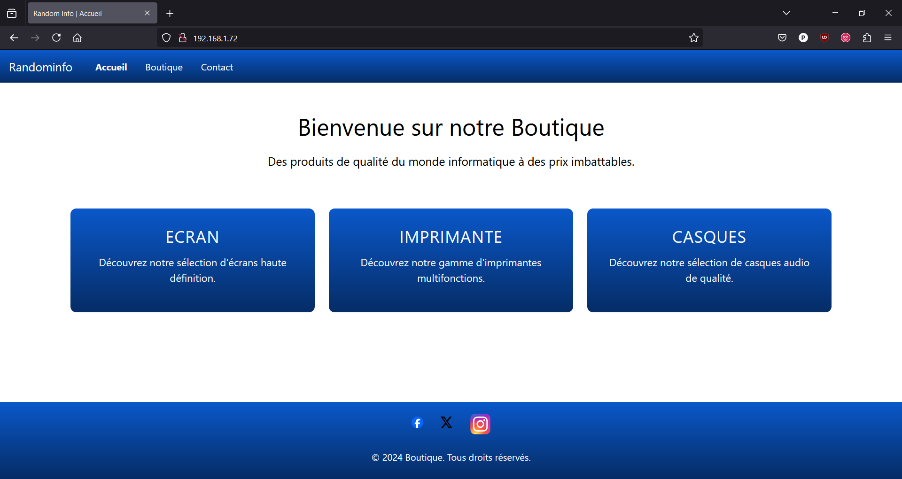

# Installation du site web Random Info

## Introduction

Les présentes instructions sont valables pour des machines virtuelles créées avec Virtualbox 7.0.20 sous Windows 11.

Ces instructions présentent l'installation du site randominfo.fr sur les systèmes d'exploitations suivants:

- Debian 12.7

- Rocky Linux 9.4

## 0. Pré-requis

- Avoir installé Virtualbox : https://www.virtualbox.org/wiki/Downloads

- Avoir créé une machine virtuelle Debian 12 et/ou Rocky Linux 9.4

- Avoir un compte github https://github.com/

## 1. Configurer la connexion par pont

_La démarche est similaire sur Debian et Rocky Linux_

### 1.1. Configuration de VirtualBox

_La machine virtuelle doit être éteinte afin de pouvoir réaliser cette configuration_

1. Aller dans la configuration de la machine Debian souhaitée

    

2. Dans le menu de gauche, cliquer sur l'onglet réseau

    

3. Dans le menu déroulant "Mode d'accès réseau", sélectionner "Accès par pont"

    

4. Dans le menu déroulant "Name", sélectionner la carte réseau utilisée pour votre connexion au réseau (pour ma part, je suis connecté en wifi, je sélectionne donc ma carte wifi)

    

5. Cliquer sur "OK" pour enregistrer les modifications

    

6. Enfin, démarrer la machine virtuelle configurée

    

### 1.2. Récupération de l'adresse ip de la machine virtuelle

1. Une fois la machine virtuelle démarrée, connectez-vous avec votre login et mot de passe

2. Saisir la commande `ip a` afin d'afficher l'adresse IP de la machine:
 
- Si vous avez effectué la configuration précédente sur "Adapter 1", vous devriez avoir un résultat similaire à ceci:

    

    Notez l'adresse ip qui apparait sur la ligne commençant par `inet` (encadrée en rouge ci-dessus)

    **Vous pouvez passer à l'étape 1.3 : Connexion à la machine en ssh**

- Si vous avez effectué la configuration précédente sur un autre adaptateur, vous devriez avoir un résultat similaire à ceci:

    

    Nous voyons que le statut de l'interface réseau enp0s8 est DOWN.

    **Un peu plus de configuration est nécessaire, veuillez suivre les indications suivantes.**

    **A partir d'ici et jusqu'à la fin de la section 1.2, les instructions ne sont valables que pour Debian**

3. Passer en super-utilisateur avec `su -` saisir le mot de passe, puis saisir la commande `nano /etc/network/interfaces`

    

    Ceci ouvre le fichier de configuration des interfaces réseau dans nano.

4. Ajouter les lignes suivantes dans ce fichier:

        auto <nom_de_l'interface>
        iface <nom_de_l'interface> inet dhcp

    

    Ceci permet d'activer l'interface et de lui attribuer une adresse IP automatiquement au lancement de la machine virtuelle.

5. Redémarrer les interfaces réseau en saisissant `systemctl restart networking`

6. Saisir la commande `ip a` afin d'afficher l'adresse IP de la machine

    

    Cette fois-ci le statut de l'interface enp0s8 est UP, et on peut voir l'adresse ipv4 de la machine sur le réseau. Notez cette adresse.

### 1.3. Connexion à la machine en ssh

1. Ouvrir un terminal powershell sur la machine hôte

2. Saisir la commande `ssh <login>@<ip_de_la_vm>` en remplaçant `<login>` par votre nom d'utilisateur sur la VM, et `<ip_de_la_vm>` par l'adresse IP notée précedemment.

    

3. Si vous ne vous êtes jamais connecté à cette machine auparavant, vous aurez un message du type "The authenticity of host can't be established. ECDSA key fingerprint is...". Il faut saisir `yes` puis "Entrée" pour confirmer.

    

4. Saisir le mot de passe du compte utilisateur associé.

5. Vous êtes connecté!

## 2. Configuration du pare-feu Rocky Linux

_Ces instructions ne sont valables que pour Rocky Linux_

_Si vous êtes sous Debian, la configuration du pare-feu n'est pas nécessaire, vous pouvez passer cette section_

### 2.0 Introduction

Cette manipulation est nécessaire si vous souhaitez activer le service http, c'est à dire débloquer le port 80 d'une machine sous Rocky Linux, afin de pouvoir accéder depuis d'autres machines aux sites web installés sur cette machine.

### 2.1. Vérifier la configuration actuelle du firewall

1. Saisir la commande `systemctl status firewalld`

    - Vous devriez obtenir un résultat similaire si le pare-feu est bien activé:

    

    Nous pouvons noter le point vert ainsi que "active (running)" à la ligne "Active:", signifiant que le statut du pare-feu est actif.

    - Si le pare-feu n'est pas activé, voici le résultat:

    

    Nous pouvons noter le point qui n'est pas vert, ainsi que "inactive (dead)" à la ligne "Active:", signifiant que le statut du pare-feu est inactif.

2. Activer le pare-feu si nécessaire en saisissant `systemctl start firewalld`

    _Pour le désactiver, la commande est_ `systemctl stop firewalld`

3. Lister les services actifs (ceux qui son débloqués) avec `firewall-cmd --list-services`

    

    Nous voyons ici trois services actifs: cockpit,  dhcpv6-client et ssh. http n'est en effet pas présent, il est donc impossible d'accéder à un site web situé sur le port 80 (port par défaut du service http).

### 2.2. Activer le service http

1. Saisir la commande `firewall-cmd --zone=public --permanent --add-service=http`. Ceci permettra d'ajouter le service http à la liste des services actifs du firewall de manière permanente et ainsi de débloquer le port 80 de la machine.

    

    Le message success indique la réussite de l'opération.

2. Redémarrer le pare-feu en saisissant `firewall-cmd --reload`

    _Ceci est nécessaire car nous avont activé le service de manière permanente. Si vous activez un service sans l'option_ `--permanent`, _cette commande, en plus de ne pas être nécessaire, annulera vos changements._

    

    Le message success indique la réussite de l'opération.

3. Saisir de nouveau `firewall-cmd --list-services`

    

    Le service http apparait maintenant dans la liste.

### 2.3. Activer le serveur apache

1. Vérifier que le serveur Apache est bien installé en saisissant `man httpd`

    

    Si le manuel s'affiche bien, c'est que le serveur est bien installé.

    Si le serveur n'est pas installé, saisissez `dnf group install "Serveur web de base"` afin de l'installer.

2. Activer le lancement automatique d'Apache au démarrage de la machine avec `systemctl enable httpd`

    

3. Démarrer le serveur avec `systemctl start httpd`

4. Vérifier qu'il est bien démarré avec `systemctl status httpd`

    

    Nous voyons ici aussi le point vert et l'indication "active (running)". Nous pouvons aussi noter sur la dernière ligne que le serveur écoute le port 443 (https) et le port 80 (http).

5. Nous pouvons maintenant saisir l'adresse ip de la machine préfixéé par http:// dans un navigateur, la page par défaut du serveur apache apparait alors!

    

## 3. Installation de git

### 3.1 Installation de Git sous debian

#### 3.1.1. Installation de Git [^1]

1. Se connecter en super-utilisateur

2. Saisir la commande `apt install git-all` 

    

3. Saisir `o` pour confirmer l'installation

    

4. Git est maintenant installé! Nous pouvons vérifier la version en saisissant `git --version`

    

5. Nous pouvons également nous déconnecter du compte root avec "Ctrl + D"

#### 3.1.2. Configuration de git [^2]

1. Configurer le nom d'utilisateur en saisissant `git config --global user.name "<votre_nom>"`

    

2. Configurer l'email en saisissant `git config --global user.email <votre_email>`

    

3. Vérifier la configuration existante avec `git config --list`
    
    

    Nous voyons le nom et l'email saisis précedemment.

4. Optionnel: Définir le nom de branche par défaut à main avec `git config --global init.defaultBranch main`

5. Les autres options de configuration sont disponibles en saisissant `git config --help`

#### 3.1.3. Connecter un compte github

1. Générer un Token sur Github

    _Si vous ne voulez pas créer de token, l'authentification via un navigateur web est aussi possible_
    
    - Se connecter à github

    - Cliquer sur l'icone de profil en haut à droite

        

    - Aller dans "Settings"

        

    - Aller dans "Developer settings"

        

    - Cliquer sur "Personal access tokens"

        

    - Puis sur "Tokens (classic)"

        

    - Cliquer sur "Generate Token"

        

    - Puis sur "Generate new token (classic)"

        

    - Entrer un nom pour le token et sélectionner une durée d'expiration

        

    - Sélectionner au minimum les autorisations suivantes: repo, workflow, read:org

        

    - Cliquer sur "Generate Token"

        

    - Copier le token généré

        

2. Installer Github CLI `apt install gh`

3. Saisir `gh auth login`

    - Sélectionner "GitHub.com"

    - Sélectionner "HTTPS"

    - Entrer `y` pour confirmer

    - Sélectionner "Paste an authentication token"

    - Coller le token

    

### 3.2 Installation de git sous Rocky Linux

#### 3.2.1. Installation de Git [^1]

1. Se connecter en super-utilisateur

2. Saisir la commande `dnf install git-all` 

3. Saisir `o` pour confirmer l'installation

4. Git est maintenant installé! Nous pouvons vérifier la version en saisissant `git --version`

5. Nous pouvons également nous déconnecter du compte root avec "Ctrl + D"

#### 3.2.2. Configuration de git [^2]

1. Configurer le nom d'utilisateur en saisissant `git config --global user.name "<votre_nom>"`

2. Configurer l'email en saisissant `git config --global user.email <votre_email>`

3. Vérifier la configuration existante avec `git config --list`

    Nous voyons le nom et l'email saisis précedemment.

4. Optionnel: Définir le nom de branche par défaut à main avec `git config --global init.defaultBranch main`

5. Les autres options de configuration sont disponibles en saisissant `git config --help`

#### 3.2.3. Connecter un compte github

1. Générer un Token sur Github

    _Si vous ne voulez pas créer de token, l'authentification via un navigateur web est aussi possible_
    
    - Se connecter à github

    - Cliquer sur l'icone de profil en haut à droite

    - Aller dans "Settings"

    - Aller dans "Developer settings"

    - Cliquer sur "Personal access tokens"

    - Puis sur "Tokens (classic)"

    - Cliquer sur "Generate Token"

    - Puis sur "Generate new token (classic)"

    - Entrer un nom pour le token et sélectionner une durée d'expiration

    - Sélectionner au minimum les autorisations suivantes: repo, workflow, read:org

    - Cliquer sur "Generate Token"

    - Copier le token généré

2. Installer Github CLI [^3]

    - `curl -fsSL https://cli.github.com/packages/rpm/gh-cli.repo | sudo tee /etc/yum.repos.d/github-cli.repo`

    - `dnf -y install gh`

    - `gh --version`

3. Saisir `gh auth login`

    - Sélectionner "GitHub.com"

    - Sélectionner "HTTPS"

    - Entrer `y` pour confirmer

    - Sélectionner "Paste an authentication token"

    - Coller le token

## 4. Récupération des fichiers du site avec git

1. Tout d'abord, se connecter en super-utilisateur `su -`

2. Se déplacer dans le dossier home `cd ~`

3. Cloner le repository git distant `git clone https://github.com/Nbenassie42/Projet-site-web.git`

## 5. Installation du site

1. Se rendre dans le dossier Projet-site-web/ `cd Projet-site-web/`

2. Exécuter le script d'installation

    - Si vous êtes sous debian, saisissez la commande `bash ./debian/install.sh`

    - Si vous êtes sous rocky linux, saisissez la commande `bash ./rocky_linux/install.sh`

## 6. Accès au site web hébergé sur la machine virtuelle

Sur la machine hôte:

1. Ouvrir un navigateur

2. Saisir dans la barre d'adresse `http://<ip_de_la_vm>` en remplaçant `<ip_de_la_vm>` par l'adresse IP notée précedemment.

    

3. Vous vous trouvez maintenant sur la page d'accueil de randominfo.fr!

    

 

---

**Notes**

[^1]: Plus d'infos: https://git-scm.com/book/fr/v2/D%c3%a9marrage-rapide-Installation-de-Git

[^2]: Plus d'infos: https://git-scm.com/book/fr/v2/D%c3%a9marrage-rapide-Param%c3%a9trage-%c3%a0-la-premi%c3%a8re-utilisation-de-Git

[^3]: Plus d'infos: https://docs.rockylinux.org/fr/gemstones/git/00-gh_cli_installation/